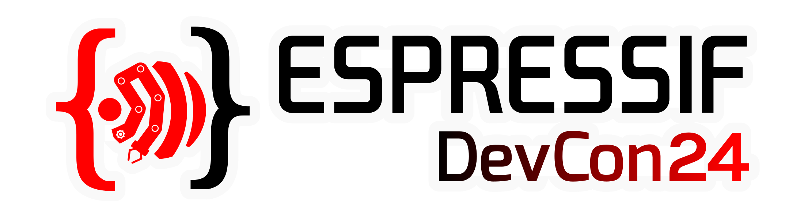

# Welcome to Espressif’s site on GitHub 

Espressif supports a large variety of open-source projects, including SDKs, components, libraries, solutions, and tools, which aim to help developers bring their projects to life.

All of Espressif’s official software, relating to the various series of ESP SoCs including ESP32  and ESP8266, are available on this GitHub site.
To check out all the series of SoCs from Espressif, please visit our [ESP Product Selector](https://products.espressif.com).

Below you can find a selection of Espressif’s open-source projects. Our full repository list can be found [here](https://github.com/orgs/espressif/repositories).

## Upcoming Event: DevCon24

    

  
Get excited and stay tuned for talks on various presentation topics, new product releases, and upgraded solutions at the Espressif Developer Conference!

### Join Us!

- **When: Sep 3-5, 13:00-18:30 CEST**
- **Where: [Espressif YouTube Channel](https://www.youtube.com/@EspressifSystems)**

We are thrilled to have you join our community of innovators and creators in the exciting world of Espressif products! The Espressif Developer Portal is not just a platform; it’s a community-driven space where ideas flourish and projects come to life.

For more information about it, please visit [DevCon24](https://devcon.espressif.com/) site.

## Frameworks

* [IoT Development Framework (ESP-IDF)](https://github.com/espressif/esp-idf)
* [Arduino Core for ESP32](https://github.com/espressif/arduino-esp32)

## Solutions
* [AT Commands Firmware (ESP-AT)](https://github.com/espressif/esp-at)
* [Communication Processor Firmware (ESP-HOSTED)](https://github.com/espressif/esp-hosted)
* [RainMaker](https://github.com/espressif/esp-rainmaker)
* [ESP-Matter](https://github.com/espressif/esp-matter)
* [Connectionless Wi-Fi Communication Protocol (ESP-NOW)](https://github.com/espressif/esp-now)

## Libraries
* [High-Performance Deep Learning (ESP-DL)](https://github.com/espressif/esp-dl)
* [Digital Signal Processing (ESP-DSP)](https://github.com/espressif/esp-dsp)

Our full repository list can be found [here](https://github.com/orgs/espressif/repositories).

To know more about our frameworks, solutions and Libraries, see this brief explanation for some of our projects: [Espressif Projects](profile/esp-projects.md).

If you are looking for the official ESP-IDF documentation, click on [this](https://docs.espressif.com/projects/esp-idf/en/latest/esp32/index.html) link and select the ESP32 series you are interested in from the dropdown menu in the top left corner.

:office: To learn about the full range of products and services that Espressif offers, please visit our official website [Espressif](https://www.espressif.com).
